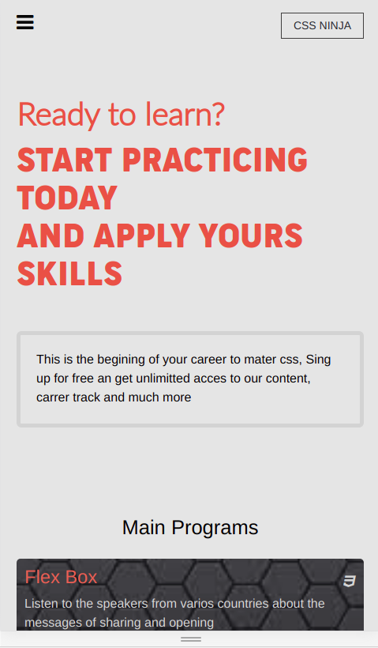
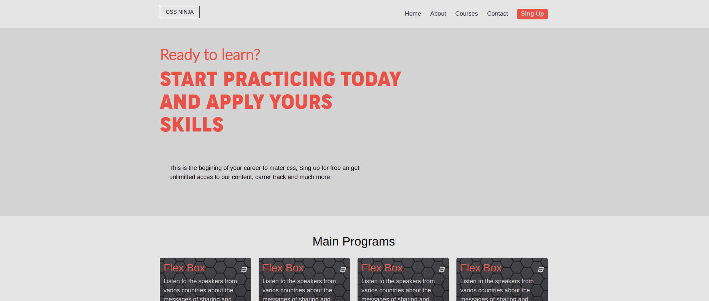

# css ninja
This project is based on a web development course, the idea is mater css 
by practicing throught building component for mobile and desktop app  
It contains the main page, about and tickets page each of 
these pages have 2 different screen sizes: mobile and desktop.

## Built With

- HTML5
- CSS3
- Bootstrap

## Live Demo

[Visit the Live Demo](https://mhdez221993.github.io/css-ninja/)

## Authors

👤 **Moises Hernandez**

- [GitHub](https://github.com/Mhdez221993)
- [Twitter](https://twitter.com/MoisesH42060050)
- [LinkedIn](https://www.linkedin.com/in/moises-hernandez-9bbb17145/)

## 🤝 Contributing

Contributions, issues, and feature requests are welcome!

Feel free to check the [issues page](../../issues/).

## Show your support

Give a ⭐️ if you like this project!

## Credits

The list of third party components used in this project, with due credits to their authors and license terms. More details can be found in the next link.

- Cindy Shin in Behance
- [credits](https://www.behance.net/gallery/29845175/CC-Global-Summit-2015)

## Acknowledgments

- Microverse
- StackOverflow
