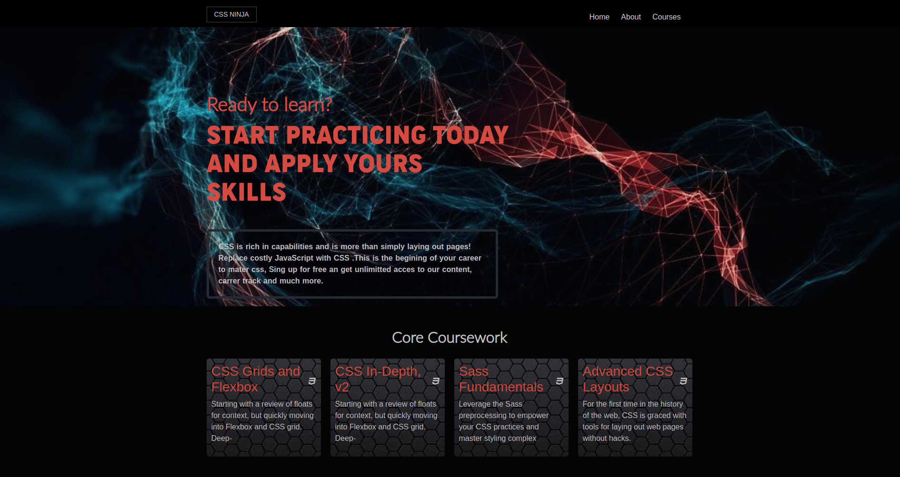

# CSS Ninja

The goal of CSS Ninja is to explore and implement CSS fundamentals through hands-on experience. This project emphasizes responsive design, layout techniques, and creating visually appealing components tailored to different screen sizes. It consists of multiple pages, each styled for optimal performance on mobile and desktop devices.

## Key Learning Objectives:

- Develop responsive layouts using CSS Grid and Flexbox.
- Understand and apply media queries for screen size adaptation.
- Explore typography, spacing, and color schemes to enhance UI/UX.
- Practice creating modular and reusable CSS components.

## Built With

- HTML5
- CSS3
- Bootstrap

## [Live Demo](https://mhdez221993.github.io/css-ninja/)

## Getting Started

To get a local copy:

- `git clone git@github.com:Mhdez221993/css-ninja.git`
- `cd css-ninja`

## Author

👤 **Moises Hernandez**

- [GitHub](https://github.com/Mhdez221993)
- [LinkedIn](https://www.linkedin.com/in/moises-hernandez-9bbb17145/)

## 🤝 Contributing

Contributions, issues, and feature requests are welcome!

Feel free to check the [issues page](../../issues/).

## Show your support

Give a ⭐️ if you like this project!

## Credits

The list of third party components used in this project, with due credits to their authors and license terms. More details can be found in the next link.

- Cindy Shin in Behance
- [credits](https://www.behance.net/gallery/29845175/CC-Global-Summit-2015)

## Acknowledgments

- Microverse
- StackOverflow
